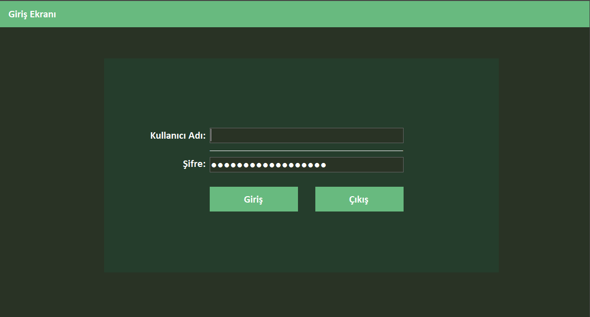
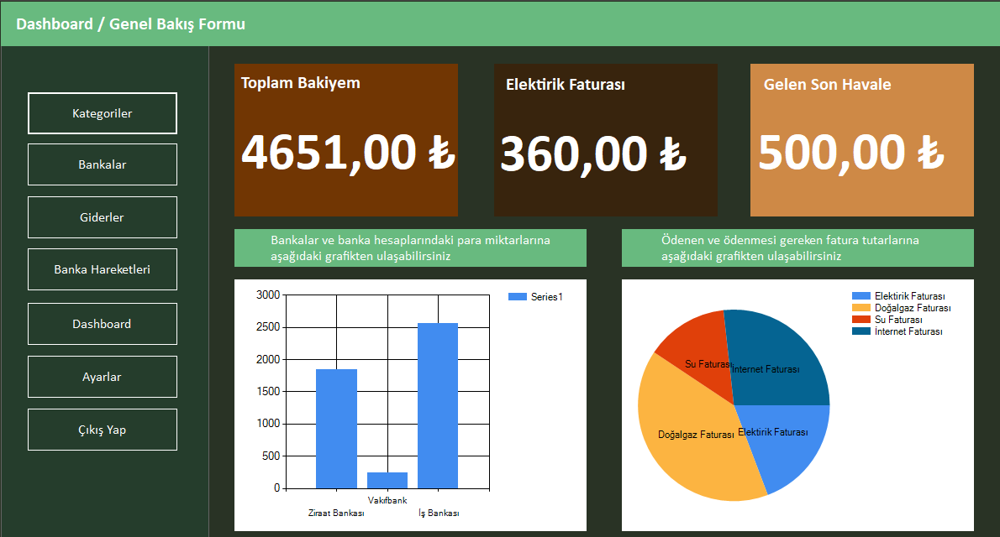
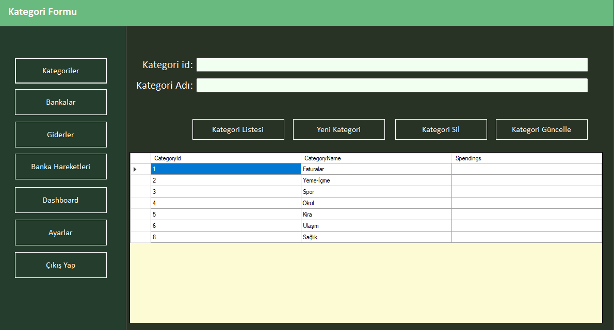
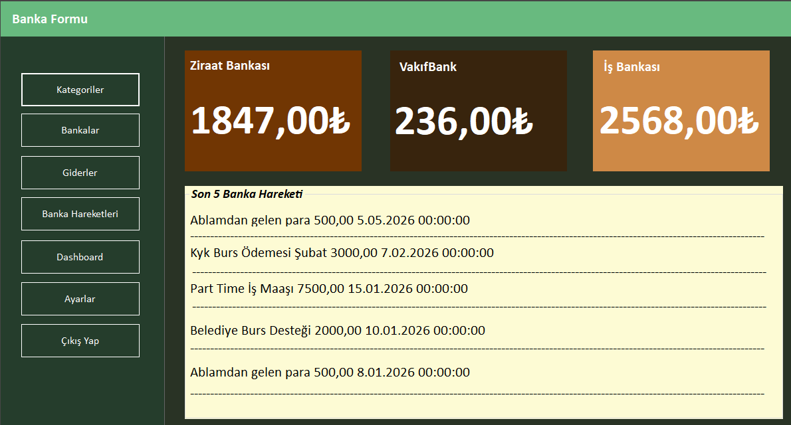
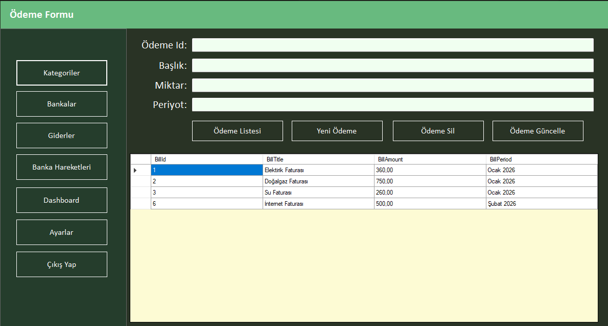
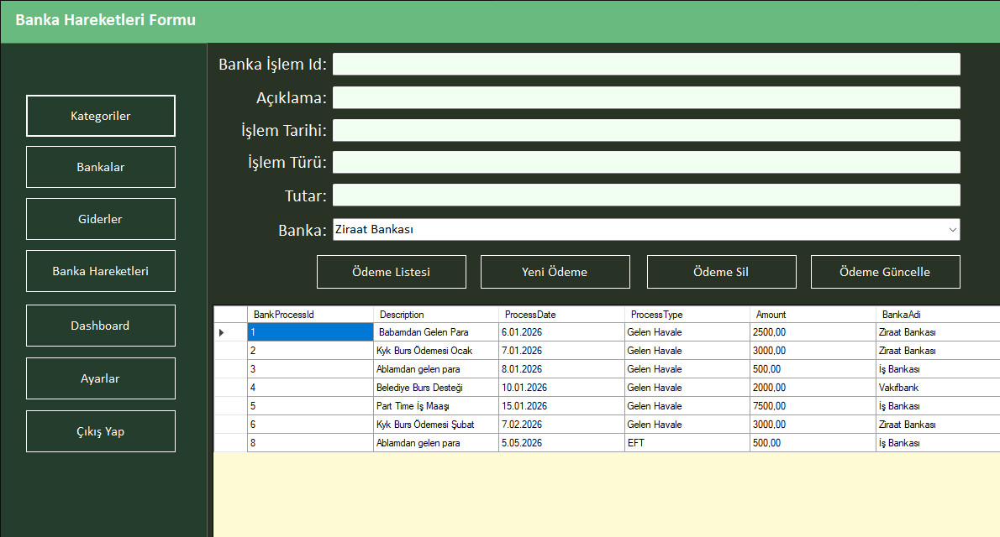
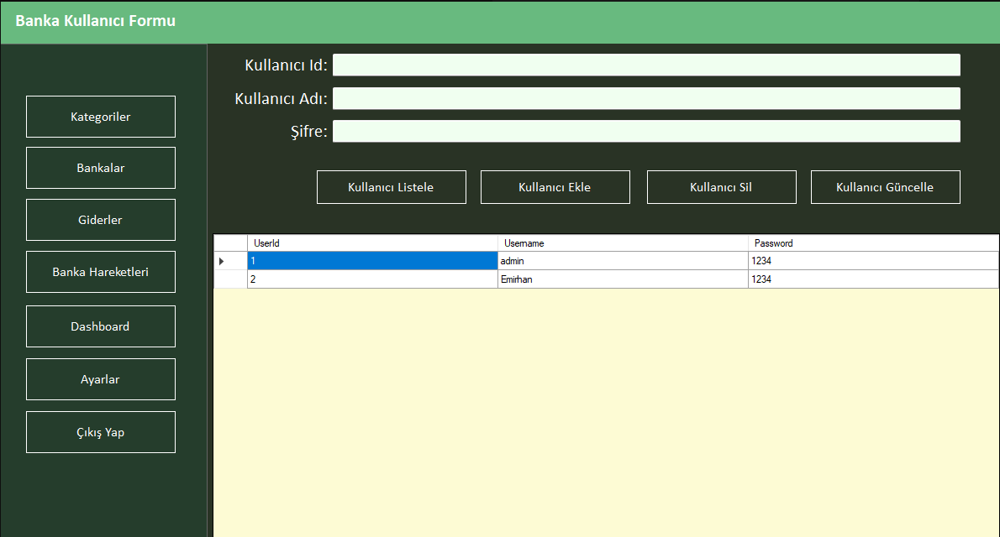

# Financial CRM (Kurumsal Finans ve Müşteri Yönetim Sistemi)

Bu proje, C# ve Windows Forms teknolojileriyle geliştirilmiş, Entity Framework ve LINQ mimarisiyle desteklenen kapsamlı bir finansal yönetim uygulamasıdır. Proje, standart işlemlerin ötesine geçerek ilişkisel veritabanı yönetimi ve modern arayüz tasarımı (UI/UX) prensiplerini barındırmaktadır.

## 🚀 Teknolojiler ve Mimari
Projeyi hayata geçirirken arka planda **C#, Entity Framework, MS SQL Server ve LINQ** kullanılmıştır. Arayüz tasarımında ise "Flat Design" kurallarına uyularak modern, çerçevesiz ve koyu tema odaklı form mimarisi tercih edilmiştir.

## 📌 Modüller ve Operasyonlar
* **Kullanıcı Yönetimi ve Giriş:** `Users` tablosu üzerinden dinamik kimlik doğrulaması yapılır. Ayarlar formunda sisteme yeni kullanıcılar (stajyer, muhasebeci) eklenebilir, şifreler güncellenebilir ve admin hesabı özel iş kurallarıyla silinmeye karşı korunur.
* **Kategori ve Gider Yönetimi:** Sistemdeki gelir/gider kalemleri için yeni kategoriler eklenebilir, isimleri güncellenebilir veya silinebilir (Full CRUD). Ayrıca elektrik, su gibi periyodik faturalar tutar ve tarih bazlı sisteme işlenir.
* **İlişkisel Banka Hareketleri:** Yabancı Anahtar (Foreign Key) ile bağlanan bankalara havale/EFT işlemleri girilir. Ekranda ID'ler yerine, LINQ izdüşüm (Projection) sorgularıyla bankaların gerçek isimleri çekilerek temiz bir görünüm sunulur.
* **Dinamik Dashboard:** Veritabanındaki tüm faturalar, toplam bakiyeler ve son işlemler LINQ sorgularıyla hesaplanarak anlık grafik (Chart) bileşenlerine aktarılır.

## 📸 Uygulama İçi Görseller ve Modül Detayları

**1. Giriş Ekranı**

> **Detaylar:** `Users` tablosu ile entegre çalışan güvenli kimlik doğrulama ekranıdır. Şifre gizleme özelliği, çerçevesiz modern tasarım ve hatalı girişlerde kullanıcıyı yönlendiren algoritma mevcuttur.

**2. Dashboard (Kontrol Paneli)**

> **Detaylar:** Sistemin özet merkezidir. LINQ sorguları kullanılarak toplam bakiye, ödenecek fatura tutarları ve son işlemler anlık hesaplanır. Veriler, Chart (Grafik) bileşenleri ile görselleştirilerek kullanıcıya sunulur.

**3. Kategori Yönetimi**

> **Detaylar:** Sistemdeki gelir ve gider kalemlerinin gruplandırıldığı formdur. Kullanıcılar buradan yeni kategoriler ekleyebilir, mevcut olanları güncelleyebilir veya silebilir (Tam kapsamlı CRUD operasyonları).

**4. Banka Bakiyeleri**

> **Detaylar:** Kayıtlı banka hesaplarının güncel bakiye durumlarını gösteren ekrandır. Yeni bir transfer yapıldığında veya ödeme alındığında, bakiyeler Entity Framework mimarisiyle veritabanından çekilerek ekrana yansıtılır.

**5. Fatura ve Gider Yönetimi**

> **Detaylar:** Elektrik, doğalgaz, internet veya kira gibi periyodik ödemelerin takip edildiği modüldür. Fatura başlığı, tutarı ve ödeme dönemi sisteme işlenerek finansal çıkışlar kayıt altına alınır.

**6. Banka Hareketleri**

> **Detaylar:** İlişkisel veritabanı mantığının (Foreign Key) en yoğun kullanıldığı ekrandır. ComboBox aracılığıyla `Banks` tablosundan dinamik liste çekilir. LINQ Projection kullanılarak, tabloda anlamsız ID'ler yerine doğrudan bankaların gerçek isimleri gösterilir.

**7. Ayarlar ve Kullanıcı Yönetimi**

> **Detaylar:** Sistemin yönetici (Admin) panelidir. Yeni kullanıcı ekleme, şifre güncelleme ve hesap silme işlemleri buradan yapılır. Sistemdeki ana yönetici hesabının silinmesini engelleyen özel iş kuralları (Business Logic) içerir.

## ⚙️ Kurulum Talimatları
1. Proje dizinini bilgisayarınıza indirin veya klonlayın.
2. Ana dizinde bulunan `FinancialCrmDb.sql` dosyasını MS SQL Server'da çalıştırıp veritabanını ve test verilerini oluşturun.
3. `App.config` içerisindeki `connectionString` satırını kendi SQL Server sunucu adınıza (Data Source) göre düzenleyin.
4. Visual Studio üzerinden projeyi derleyip çalıştırın.
